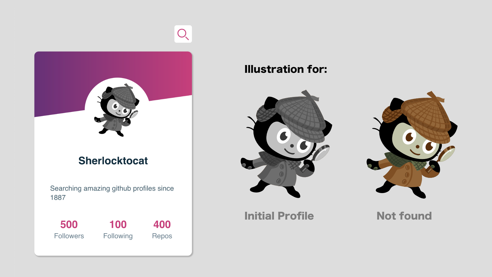
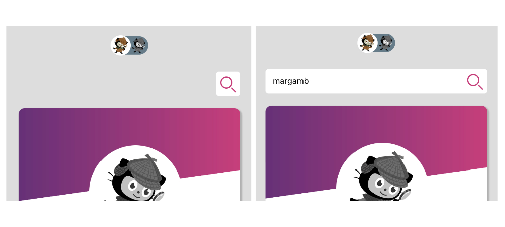
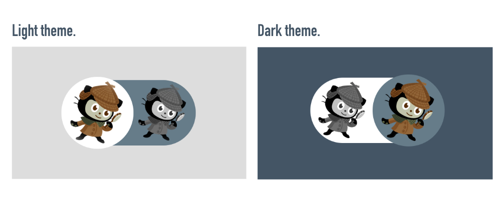
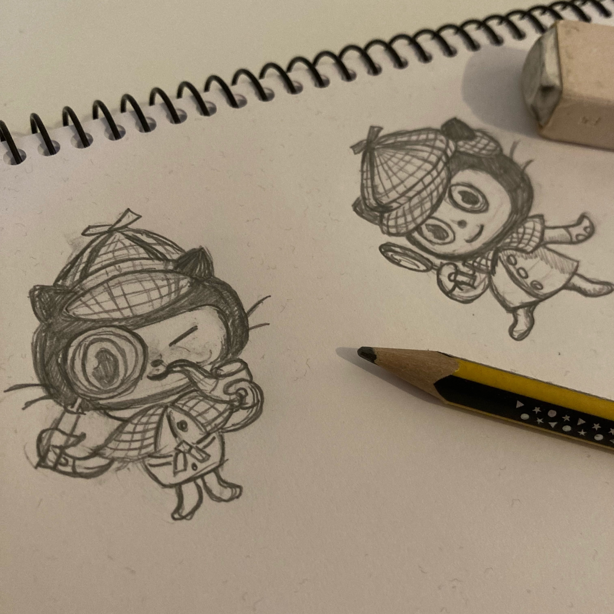
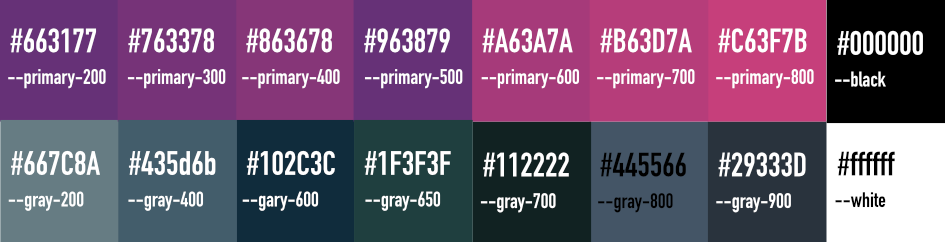

# Sherlocktocat App ⚛️ 

A Sherlocktocat app I created to improve my react and javascript. I wanted to learn more about fetch and I chose the API of github for this. I enjoyed doing a reusable component with its own illustrations.

This app has an animation input and a reusable profile component. You can search a github profile and see the information on the profile card. The idea was to create a reusable component and improve my fetch calls

### State of component

There are three states: Initial, not found and result is ok.

To do that I created two different illustrations to show that. 

- **Initial component**: I did a Sherlocktocat object to render the component when the user enters the app.

- **Not found**: I did another object to render when the user enters a github profile name and it doesn't exist (when the status is not 200).

- **Result of the search is ok** and the component shows a github profile.

The input has an animation that grows and shrinks when the user searches for a github user. 

I crafted a reusable checkbox component to change the theme of the app.

The Sherlocktocat ilustration was created using a pencil 👩🏻‍🎨 and inked with Affinity Designer.

### Color 🌈 

I always start designing in black and white. It's the best option to get a sense of balance and rhythm in a design. Then I make a color palette depending on the mood I want to convey.

